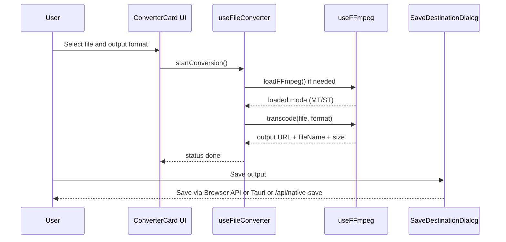

# Architecture Spine - VideoForge Platform Architecture

## Design Paradigm

VideoForge uses a layered application design with explicit runtime adapter boundaries:

- Presentation layer: Next.js App Router pages and React/MUI components render state and collect user intent.
- Orchestration layer: `useFileConverter` owns conversion job lifecycle and state transitions.
- Engine layer: `useFFmpeg` encapsulates FFmpeg load strategy, command execution, and output artifact creation.
- Runtime adapter layer: save operations route through browser File System Access API, Tauri command bridge, or Node native-save route.
- Packaging layer: build scripts and output modes produce standalone server artifacts or static export artifacts for desktop web packaging.

## Invariants & Rules

```mermaid
graph LR
  UI[UI Components] --> ORCH[useFileConverter]
  ORCH --> ENG[useFFmpeg]
  ORCH --> SAVEUI[SaveDestinationDialog]
  SAVEUI --> BROWSER[Browser File System Access]
  SAVEUI --> TAURI[Tauri invoke save_file_with_dialog]
  SAVEUI --> ROUTE[/api/native-save]
  ROUTE --> OSDLG[OS Native Save Dialog]
```

### AD-1 - Dual build mode is explicit and environment driven

- **Binds:** build-modes, deployment packaging
- **Prevents:** runtime/build drift between standalone server and static export artifacts
- **Rule:** Build mode is selected only by `NEXT_OUTPUT_MODE` (`standalone` default, `export` for desktop web build), and all build/publish scripts must preserve this contract.

### AD-2 - Converter state transitions are centralized in one orchestration hook

- **Binds:** conversion-flow, UI status behavior
- **Prevents:** inconsistent status/progress/error handling across components
- **Rule:** `useFileConverter` is the only owner of `ConversionJob` state transitions (`idle -> loading -> converting -> done|error`), and UI components read/trigger via that contract.

### AD-3 - FFmpeg engine loading follows deterministic fallback order

- **Binds:** ffmpeg-loading, conversion reliability
- **Prevents:** nondeterministic startup behavior and avoidable conversion failures
- **Rule:** FFmpeg load attempts must follow: local multithreaded -> local single-threaded -> CDN multithreaded -> CDN single-threaded.

### AD-4 - Save capability gating must include all runtime paths

- **Binds:** runtime-save, UX reliability
- **Prevents:** disabled save CTA in valid runtimes
- **Rule:** Save destination availability must consider all supported paths: browser File System Access API, Tauri native save command, and local Node route (`/api/native-save`) fallback.

### AD-5 - Native save route remains Node-only with static segment config literal

- **Binds:** runtime-save, export compatibility
- **Prevents:** export build breakage and route misconfiguration
- **Rule:** `src/app/api/native-save/route.ts` must keep `runtime = 'nodejs'` and static literal `dynamic = 'force-static'`; export-mode behavior gates are handled inside request handlers.

### AD-6 - Type and format definitions are centralized

- **Binds:** conversion-flow, output naming, UI compatibility
- **Prevents:** incompatible format metadata and ad-hoc type drift
- **Rule:** Output formats, MIME metadata, and conversion job shape are defined in shared `src/types/index.ts` and `src/utils/formatUtils.ts`, consumed by hooks and UI.

### AD-7 - FFmpeg assets are prebuilt local artifacts for production

- **Binds:** ffmpeg-loading, build reliability
- **Prevents:** production startup failures caused by missing core assets
- **Rule:** Production builds must run `prepare:ffmpeg-assets` before Next build so `public/ffmpeg-core` and `public/ffmpeg-core-mt` are present.

### AD-8 - Desktop shell consumes exported web frontend

- **Binds:** desktop packaging, runtime consistency
- **Prevents:** mismatch between Tauri shell and web app artifacts
- **Rule:** Tauri build pipeline must use static export output (`beforeBuildCommand: npm run build:desktop:web`, `frontendDist: ../out`) as the desktop UI source.

## Consistency Conventions

| Concern | Convention |
| --- | --- |
| Naming (entities, files, interfaces, events) | Keep domain-first naming: `ConversionJob`, `VideoFormat`, `useFileConverter`, `useFFmpeg`, `SaveDestinationDialog`. |
| Data and formats (ids, dates, error shapes, envelopes) | Use explicit TS unions for status/format; use shared format metadata for extension+MIME; use human-readable error strings surfaced to UI. |
| State and cross-cutting (mutation, errors, logging, config, auth) | Hook-owned immutable updates for conversion state; errors normalized to user-visible message; build/runtime behavior controlled by environment variables and runtime probes. |

## Stack

| Name | Version |
| --- | --- |
| Node.js runtime (project tooling target) | Active LTS expected |
| TypeScript | ^5 |
| Next.js | 16.2.4 |
| React | 19.2.4 |
| Material UI | 9.0.0 |
| @ffmpeg/ffmpeg | ^0.12.15 |
| @ffmpeg/core | ^0.12.6 |
| @ffmpeg/core-mt | 0.12.6 |
| Tauri API | ^2.10.1 |
| Jest | ^30.3.0 |
| Testing Library React | ^16.3.2 |

## Structural Seed

```mermaid
graph TD
  USER[End User] --> WEB[Web Browser App]
  USER --> TAURIAPP[Tauri Desktop App]

  WEB --> NEXTSSR[Next.js Standalone Server]
  WEB --> EXPORT[Static Export Build]

  NEXTSSR --> NATIVEAPI[/api/native-save route]
  NATIVEAPI --> OSDIALOG[OS Save Dialog via shell commands]

  TAURIAPP --> EXPORT
  TAURIAPP --> TAURICMD[save_file_with_dialog Rust command]
  TAURICMD --> OSDIALOG2[OS Save Dialog via rfd]

  WEB --> FFMPEG[FFmpeg WASM Core Assets]
  TAURIAPP --> FFMPEG
```



```text
src/
  app/
    api/native-save/route.ts      # Node runtime native save bridge for standalone mode
    layout.tsx                    # app shell and global metadata
    page.tsx                      # root page embedding converter UI
  components/
    ConverterCard.tsx             # primary orchestration UI
    ConverterCardDynamic.tsx      # client-only boundary for heavy FFmpeg UI
    SaveDestinationDialog.tsx     # runtime-aware save adapter UI
  hooks/
    useFileConverter.ts           # conversion job state machine
    useFFmpeg.ts                  # ffmpeg loading + transcode adapter
  utils/
    formatUtils.ts                # format metadata and output naming
  types/
    index.ts                      # domain type contracts

src-tauri/
  src/main.rs                     # tauri native save command bridge
  tauri.conf.json                 # desktop build wiring to exported frontend

scripts/
  prepare-ffmpeg-assets.mjs       # prebuild ffmpeg asset copy
  create-release.mjs              # standalone bundle generation
```

## Capability -> Architecture Map

| Capability / Area | Lives in | Governed by |
| --- | --- | --- |
| Video input and conversion flow | `src/components/ConverterCard.tsx`, `src/hooks/useFileConverter.ts` | AD-2, AD-6 |
| FFmpeg execution and fallback loading | `src/hooks/useFFmpeg.ts`, `public/ffmpeg-core*` | AD-3, AD-7 |
| Multi-runtime save behavior | `src/components/SaveDestinationDialog.tsx`, `src/app/api/native-save/route.ts`, `src-tauri/src/main.rs` | AD-4, AD-5, AD-8 |
| Build and release outputs | `next.config.ts`, `package.json`, `scripts/*.mjs`, `src-tauri/tauri.conf.json` | AD-1, AD-7, AD-8 |

## Deferred

- Audio-focused output strategy expansion (MP3-only mode, quality profile UX, naming suffix policy) is deferred to feature implementation artifacts and stories.
- Observability standardization (structured client telemetry and conversion failure analytics) is deferred due hobby scope.
- Formal API contract schema for `/api/native-save` is deferred; current JSON envelope is sufficient for current runtime adapters.
